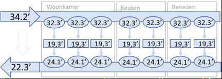

# Heat controller




## Options

| Name | Type | Requirement | Description
| ---- | ---- | ------- | -----------
| type | string | **Required** | `custom:heat-controler`
| title | string | **Optional** | A string you want to show as title
| input | string | **Required** | The entity_id of the input temperature sensor.
| output | string | **Required** | The entity_id of the output temperature sensor.
| motor | string | **Required** | The entity_id of the motor entity on / off.
| show_empty | boolean | **Optional** | Give you the possibility to show `unavailable` if the state is empty, default `false`
| zones | list | **Required** | A list of all zones

### Zone
| Name | Type | Requirement | Description
| ---- | ---- | ------- | -----------
| zone | string | **Required** | A string you want to show as title
| rooms | list | **Optional** | One or more rooms that define this zone
| circuits | list | **Optional** | A string you want to show as title

### Circuit
| Name | Type | Requirement | Description
| ---- | ---- | ------- | -----------
| circuit | string | **Optional** | A string you want to show as title
| input | string | **Required** | The entity_id of the input temperature sensor.
| output | string | **Required** | The entity_id of the output temperature sensor.
| sensor | string | **Optional** | The entity_id of the room temperature sensor related to this circuit.
| rooms | list | **Optional** | One or more rooms that define this circuit

### Room
| Name | Type | Requirement | Description
| ---- | ---- | ------- | -----------
| room | string | **Required** | A string you want to show as title
| temperature | string | **Optional** | The entity_id of the room temperature sensor related to this circuit.


## Installation

### Step 1

### Step 2

Link `state-element` inside you `ui-lovelace.yaml`.


### Step 3

Add a custom element in your `ui-lovelace.yaml`

```yaml
     - title: Downstairs heat controller
        type: custom:heat-controler
        input: sensor.floor_downstairs_main_in
        output: sensor.floor_downstairs_main_out
        zones:
          - zone: Beneden
            circuits:
              - circuit: beneden 1
                input: sensor.floor_downstairs_6_in
                output: sensor.floor_downstairs_6_out
                rooms: 
                  - room: Hal 1
                  - room: Hal 2
                    temperature: sensor.2_temperature
                    humidity: sensor.2_humidity
                  - room: Washok
              - circuit: beneden 2
                input: sensor.floor_downstairs_7_in
                output: sensor.floor_downstairs_7_out
                rooms: 
                  - room: Study
          - zone: Woonkamer
            rooms: 
              - room: Woonkamer
                temperature: sensor.3_temperature
                humidity: sensor.3_humidity
            circuits:
              - circuit: living 1
                input: sensor.floor_downstairs_1_in
                output: sensor.floor_downstairs_1_out
              - circuit: living 2
                input: sensor.floor_downstairs_2_in
                output: sensor.floor_downstairs_2_out
              - circuit: living 3              
                input: sensor.floor_downstairs_3_in
                output: sensor.floor_downstairs_3_out
          - zone: Keuken
            rooms: 
              - room: Keuken
            circuits:
              - circuit: keuken 1
                input: sensor.floor_downstairs_4_in
                output: sensor.floor_downstairs_4_out
              - circuit: keuken achter
                input: sensor.floor_downstairs_5_in
                output: sensor.floor_downstairs_5_out   
```

## Example with styles

```yaml
     - title: Downstairs heat controller
        type: custom:heat-controler
        input: sensor.floor_downstairs_main_in
        output: sensor.floor_downstairs_main_out
            style:
              top: 47%
              left: 5px
              transform: none
```

